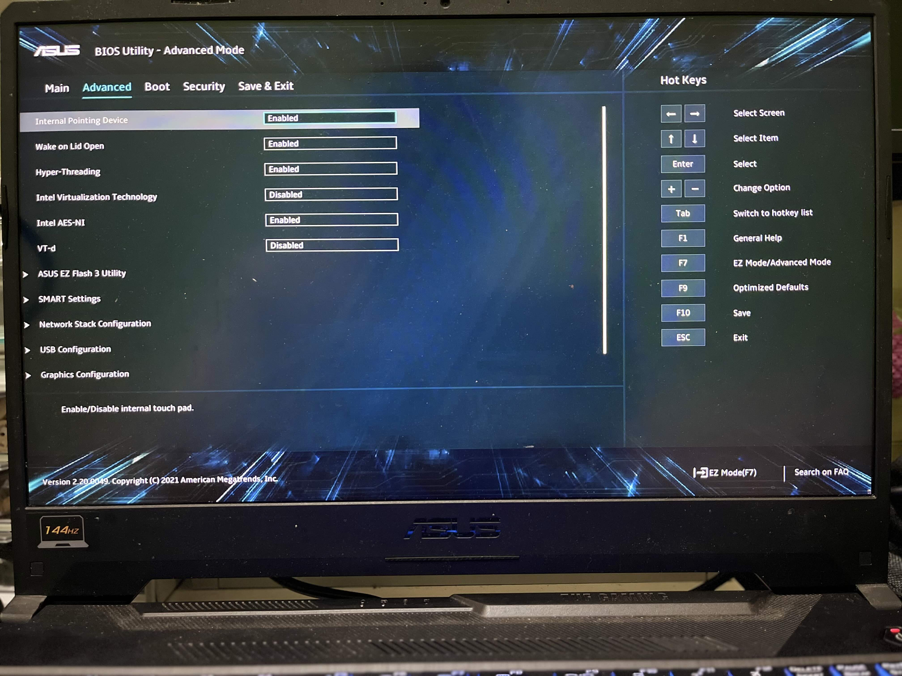
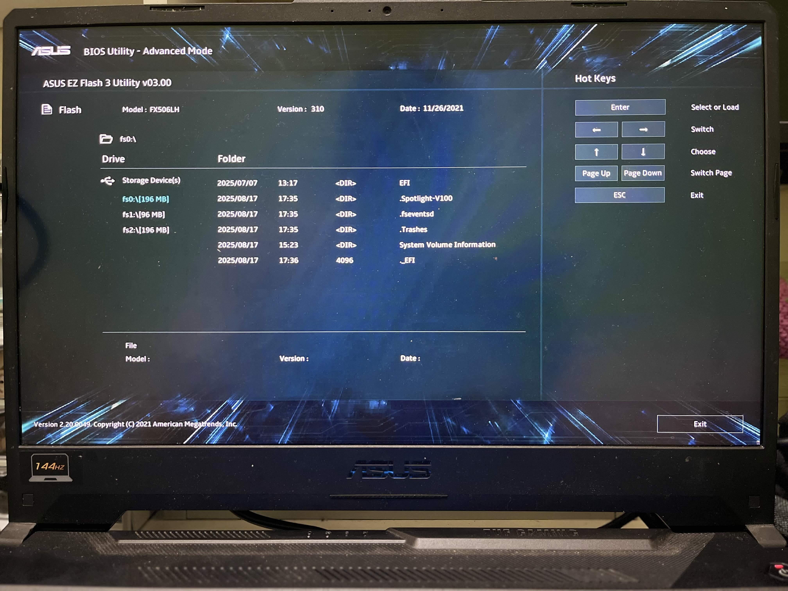

# 💻 ASUS TUF GAMING F15 FX506LH

This repository documents the configuration and setup of my **ASUS TUF GAMING F15 FX506LH**.  
It includes hardware specifications, BIOS configuration, and other related notes that might help others using the same laptop model.

---

## 🔧 Hardware Specifications

- **Processor**: Intel® Core™ i7-10750H (Comet Lake)  
- **Integrated GPU**: Intel® UHD Graphics  
- **Dedicated GPU**: NVIDIA GeForce GTX 1650  
- **Storage**: Micron 512GB NVME M.2 2210 SSD MTFDHBA512QFD
- **Storage**: Kingston 512GB NVME M.2 2280 SSD OM8PCP3512F-AB
- **Memory**: 64GB DDR4 3200MHz  
- **Ethernet**: Realtek RTL8168  
- **Wireless**: Intel AX201  
- **Trackpad**: I2C HID  
- **Audio**: Realtek ALC256  

---

## 🖥️ BIOS Configuration

Below are the BIOS settings and configuration screenshots for reference:  

---

## 📌 Notes

- This documentation may be useful for Hackintosh, Linux, or custom OS installation.  
- Feel free to contribute or open issues if you have the same model and want to share tips.  

---

## 📚 License

This repository is maintained for educational and documentation purposes.  
See [LICENSE](./LICENSE) for more information.  
